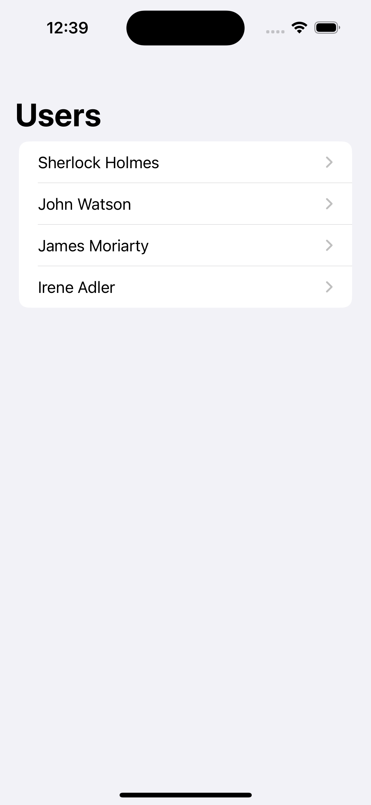
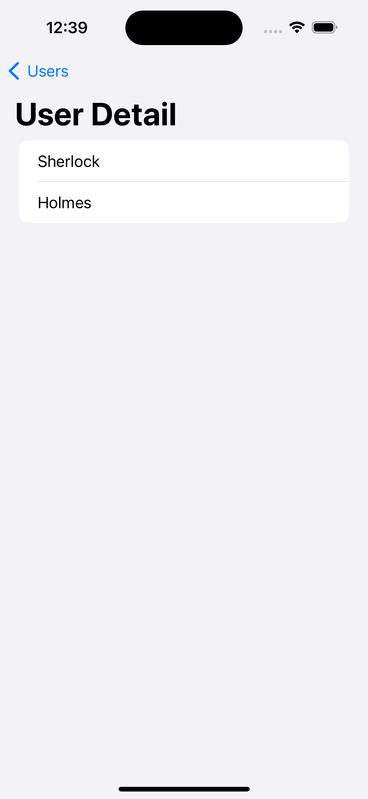

## SwiftUI NavigationStack and Binding parameters

## Routes
```swift
import SwiftUI

enum Routes: Hashable {
    case users
    case userDetail(user: Binding<User>)
    
    func hash(into hasher: inout Hasher) {
        switch self {
        case .userDetail(let user):
            hasher.combine(user.wrappedValue)
        default:
            hasher.combine(self)
        }
    }
    
    static func == (lhs: Routes, rhs: Routes) -> Bool {
        lhs.hashValue == rhs.hashValue
    }
}
```

## Route Destinations
```swift
import SwiftUI

extension View {
    func withRoutes() -> some View {
        self.navigationDestination(for: Routes.self) { route in
            switch route {
            case .users:
                UsersView()
            case .userDetail(let user):
                UserDetailView(user: user)
            }
        }
    }
}
```

### Users Page


### User Detail Page

